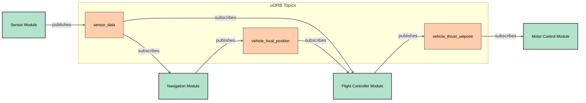

# Control software voor Robosub
## By: Daan Smienk

<br>

### Find the slides at: 
### https://mightypiggie.github.io/px4-les

---
hideInToc: true
---

# Table of contents

<Toc maxDepth="1"></Toc>

---

# Background information
Why do we even need software to control the submarine?
:: v-click
- 🛠 **Can't do anything without** - Without any software we can't control the vehicle
:: v-click
- 📝 **Requirements** - What should the software be capable off?
:: v-click
- 🧑‍💻 **PX4** - Autopilot software mainly for drones
:: v-click
- 🤹 **modular** - PX4 is very modular by design

---

# Global overview
:: v-click
- PX4 is a modular autopilot software, which means that it is designed to be flexible and adaptable to different types of vehicles and applications.

:: v-click


<!--
[click:2] In this diagram you can see the different components of the PX4 autopilot software. The main components are the modules, drivers, and uORB.

Even within these modules there are different modules. ***Most important are the apps/modules which we will mostly be working with.*** 

-->

--- 

# uORB

:: v-click
- Needs a way to communicate between modules
:: v-click
- uORB is a lightweight publish-subscribe messaging system that allows modules to communicate with each other in a decoupled way.
:: v-click
- With uORB, modules can publish messages to topics, and other modules can subscribe to those topics to receive the messages without knowing each others.
:: v-click

<!-- 
[click:1] As stated before PX4 is modular based. These modules need a way to communicate with each other. **What a module exactly is will be explained later.**

[click:1] uORB is a lightweight publish-subscribe messaging system that allows modules to communicate with each other in a decoupled way. 
It stands for micro (u) Object Request Broker (ORB).

[click:2]An example is a sensor module that publishes sensor data to a topic, and a navigation module that subscribes to that topic to receive the sensor data. Which parses the data and calculates the position of the vehicle. Which then publishes the position to another topic, and a flight control module that subscribes to that topic to receive the position data and control the motors accordingly.

This way the modules don't need to know each other. They can live independently and communicate through the uORB topics. This makes it easy to add or remove modules without affecting the rest of the system.

-->


---
hideInToc: true
---

  Example of a message:
  <br>
  <br>
  
``` {all|1|1|2|4|6-7|all}
uint64 timestamp        # time since system start (microseconds)
uint64 timestamp_sample # timestamp of the data sample on which this message is based (microseconds)

float32[3] xyz          # thrust setpoint along X, Y, Z body axis [-1, 1]

# TOPICS vehicle_thrust_setpoint
# TOPICS vehicle_thrust_setpoint_virtual_fw vehicle_thrust_setpoint_virtual_mc
```

<arrow v-click="[2, 3]" x1="10" y1="90" x2="45" y2="130" color="#953" width="2" arrowSize="1" />

<br>
Code example for publishing a message:
```cpp {all|1|2|4|5|7-9|11|all}
uORB::Publication<px4::msg::VehicleThrustSetpoint> _vehicle_thrust_setpoint_pub{ORB_ID(vehicle_thrust_setpoint)}; // define the publication
vehicle_thrust_setpoint_s _vehicle_thrust_setpoint{}; // and the message

_vehicle_thrust_setpoint.timestamp = hrt_absolute_time(); // set the timestamp. This parameter is in every message
_vehicle_thrust_setpoint.timestamp_sample = hrt_absolute_time(); // and the sample timestamp

_vehicle_thrust_setpoint.xyz[0] = 1; // fill the message with data
_vehicle_thrust_setpoint.xyz[1] = 0; // every message can have different data
_vehicle_thrust_setpoint.xyz[2] = -1; // and the data can be different for every message

_vehicle_thrust_setpoint_pub.publish(_vehicle_thrust_setpoint); // lastly publish the message
```
<!-- 
[click] A message is defined in a .msg file. When compiling the code, the .msg file is converted to a C++ header file.

[click] Each data point also needs a datatype. 
-->

---

Code example for subscribing to a topic:
```cpp {all|1|2|4-5|7,9|8|11|13,18|13-18|all}
uORB::Subscription _vehicle_thrust_setpoint_sub{ORB_ID(vehicle_thrust_setpoint)}; // define the subscription
vehicle_thrust_setpoint_s _vehicle_thrust_setpoint{}; // and the message

// if you want the Run() function to be called when a message is received
uORB::SubscriptionCallbackWorkItem _vehicle_thrust_setpoint_sub{this, ORB_ID(vehicle_thrust_setpoint)};

if (_vehicle_thrust_setpoint_sub.update()) { // check if a new message is published
  vehicle_thrust_setpoint_s.copy(&rc_data); // copy the message to the local variable
}

// or alternatively

if (_vehicle_thrust_setpoint_sub.update(&_vehicle_thrust_setpoint)) { // check if a new message is published
  // do something with the message
  float thrust_x = _vehicle_thrust_setpoint.xyz[0]; // get the thrust value
  float thrust_y = _vehicle_thrust_setpoint.xyz[1]; // get the thrust value
  float thrust_z = _vehicle_thrust_setpoint.xyz[2]; // get the thrust value
}
```

---
layout: image-right
image: https://docs.px4.io/main/assets/PX4_Architecture.BOZwmjrc.svg
---
# Modules

:: v-click
- Modules are the main building blocks of the PX4 autopilot software. They are self-contained units of code that perform specific functions.
:: v-click
- Each module can have its own set of parameters, and can be configured to run at different rates.
:: v-click
- Modules can be started and stopped independently just like a program, and can communicate with each other using uORB.
:: v-click
- Besides modules there are also drivers, these implement the low level code for hardware.

<!-- 
In the image you can see the different modules in the PX4 autopilot software.
Within the source code there are different types of modules. But the most important ones are the drivers and modules. Drivers implement the low level code for the hardware.
Modules are the high level code that uses the drivers to control the hardware.

[click] A module is responsible for a specific task, such as controlling the motors. This way the code is more modular and easier to maintain.
-->

---

# How did I implement the motor control?

:: v-click
- I started just looking through different modules and they worked.
:: v-click
- I used the uuv_att_control module as a reference. This module is used to control the attitude of the vehicle.
:: v-click
- I wanted to implement a simple motor control module that would control the motors based on the remote control.
  - I started with dividing the problem into smaller pieces
  - First part was receiving the remote control data
  - Second part was controlling the motors
:: v-click
- First part was receiving the remote control data
:: v-click
```cpp
MavlinkReceiver::handle_message(mavlink_message_t *msg)
{
  switch (msg->msgid) {
    // A lot of cases
    case MAVLINK_MSG_ID_RC_CHANNELS_OVERRIDE:
		  handle_message_rc_channels_override(msg);
		  break;
  // A lot of cases
  }
}
```

<!-- 
[click] After looking through the different modules and reading documentation. I noticed constantly that uORB was used a lot so I started looking into it.
Then I started with just a simple program that published a message to a topic and subscribed to that topic.

[click] Next I wanted to try to implement motor control. So I started to look at different modules that did similar things. I found uuv_att_control which did attitude control.

[click] First I wanted to receive simple data so I went to the code so see how this data was received and published. I knew we were sending mavlink messages so I started looking into that. and noticed that the data was parsed in the mavlink_receiver.cpp file and then published to the ... topic. 
-->

---

```cpp {all|1|4|10|12-18|20-23|25|all}
MavlinkReceiver::handle_message_rc_channels_override(mavlink_message_t *msg)
{
	mavlink_rc_channels_override_t man;
	mavlink_msg_rc_channels_override_decode(msg, &man);
	// Check target
	if (man.target_system != 0 && man.target_system != _mavlink.get_system_id()) {
		return;
	}
	// fill uORB message
	input_rc_s rc{};
	// metadata
	rc.timestamp = rc.timestamp_last_signal = hrt_absolute_time();
	rc.rssi = input_rc_s::RSSI_MAX;
	rc.rc_failsafe = false;
	rc.rc_lost = false;
	rc.rc_lost_frame_count = 0;
	rc.rc_total_frame_count = 1;
	rc.input_source = input_rc_s::RC_INPUT_SOURCE_MAVLINK;
	// channels
	rc.values[0] = man.chan1_raw;
	rc.values[1] = man.chan2_raw;
	rc.values[2] = man.chan3_raw;
 // ...

 	_rc_pub.publish(rc);
}

```

<!-- 
What happens here is that first the message is decoded and the decoded message is used to fill the uORB message. 
After which the message is published to the uORB topic. This is exactly what I was looking for!
-->

---

So now we have the data of the remote control what now?

:: v-click
- Then I started looking into how other modules did the motor control.
:: v-click
- I found that most modules used the uORB message vehicle_thrust_setpoint.
  - However this indirectly controlled the motors.
  - I wanted to control the motors directly.
:: v-click
- I knew qgroundcontrol could "test" motors so I started looking into how this worked.
  - I found that it used a module called ActuatorTest
:: v-click
Inside the module:
:: v-click
```cpp {all|1-2|3-10|9|all}
// It was subscribed to the actuator_motors topic
	uORB::Subscription _actuator_motors_sub{ORB_ID(actuator_motors)};
// inside the update function
if ((int)OutputFunction::Motor1 <= actuator_test.function && actuator_test.function <= (int)OutputFunction::MotorMax) {
          actuator_motors_s motors;
          motors.reversible_flags = 0;
          _actuator_motors_sub.copy(&motors);
          int motor_idx = actuator_test.function - (int)OutputFunction::Motor1;
          FunctionMotors::updateValues(motors.reversible_flags >> motor_idx, thrust_curve, &value, 1);
        }
```

<!--
[click:2]The reason why I didn't continue with vehicle_thrust_setpoint is not just because I wanted to control the motors directly, because the better way is to use vehicle_thrust_setpoint.
But because I wanted to understand how the system worked and how the modules communicated with each other. And because it was easier to directly control a single motor.
-->

---

```cpp {all|3|4|8-9|all}
actuator_test_s actuator_test{};
actuator_test.timestamp = hrt_absolute_time();
actuator_test.function = function;
actuator_test.value = value;
actuator_test.action = release_control ? actuator_test_s::ACTION_RELEASE_CONTROL : actuator_test_s::ACTION_DO_CONTROL;
actuator_test.timeout_ms = timeout_ms;

uORB::Publication<actuator_test_s> actuator_test_pub{ORB_ID(actuator_test)};
actuator_test_pub.publish(actuator_test);
```


So after publishing the message to the actuator_motors topic (and also one to the actuator_controls topic) I can control the motors.

<!--
There are some values like the action and function which I am not sure of what they do, but they are not really necessary to know what they exactly mean in order for it to work. For example the function starts from 101 for the first motor and goes up by 1 for every motor. I thought servo's start at 201 but I am not sure.
-->

---

# How I envision the control software
:: v-click
- I want to use the PX4 autopilot software as a base for the control software. And build on top of that by reusing as much code as possible.
:: v-click
- I want to use the uORB messaging system to communicate between the different modules.
:: v-click
- Create smaller modules that do a specific task. This way the code is more modular and easier to maintain.
:: v-click
- Communicate with the Jetson using (custom) mavlink messages.
:: v-click
- Use the build in logging system to log the data. This way we can easily log the data and analyze it later.
:: v-click
- Besides listening what to do from the Jetson, there should be redundancy for all the tasks the Jetson does, so for example when we need to navigate we can still do that without the Jetson.
:: v-click
- Currently I have defined the following modules:
  - Motor control
  - Navigation
  - Robot arm control
  - Remote control
  - Object detection and avoidance
  - CAN FD to uORB (not sure yet)

---

# Questions?